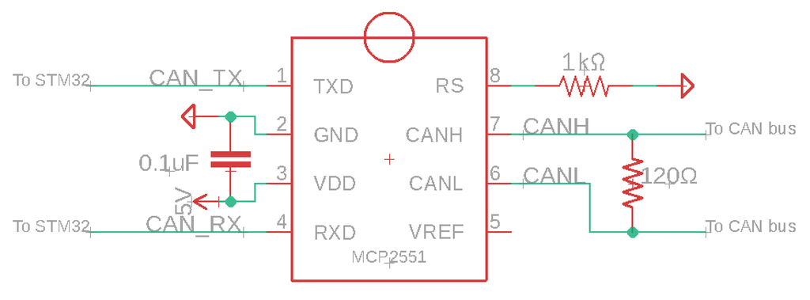

# Blue Pill CAN Test

This project is a simple test harness for using the CAN BUS protocol with the STM32 Blue Pill

## Hardware

This demo used a Blue Pill with an STM32F103C8T6 processor. It only has a single CAN bus so to test the software the internal loopback mode was used (CAN_MODE_LOOPBACK)

To test externally, an MCP2551 transceiver was added to the circuit and this was connected a PCAN USB dongle which confirmed operation. 

Bit timing the hardware for CAN was a little tricky although [CAN BIT Timing](http://www.bittiming.can-wiki.info/) provided the majority of the information required. It is also worth noting that the clock rate setting was 36mhz. This being the AP1B perhiperal value in the clock setup screen (the clock input to the CAN hardware is detailed in the STM spec sheet). 

## Software

The software project is included in the GIT. It is relatively simple and just sends a 1 byte CAN message, ID 0x100. The software will also receive (with a filter) 0x100 messages and turn on the green LED on the board to demonstrate this. It is interrupt driven on a CAN receive event.

## Quirks

* The MCP2551 needs PIN 8 tied to ground (via a 1k resistor - see data sheet) to actually output anything sensible. 

* If using the CAN_MODE_NORMAL, if nothing is connected to the Rx pin the CAN bus will probably stay in the sleep state. You can use the AutoWakeup functionality to try and override this but in this state you will not see anything on the Tx pin if you try to send a message.

* The CAN_MODE_LOOPBACK mode is quite useful as you can still see the output on the Tx pin if you oscilliscope it - the Rx pin will ignore any input on it in this mode.

## Useful web links

